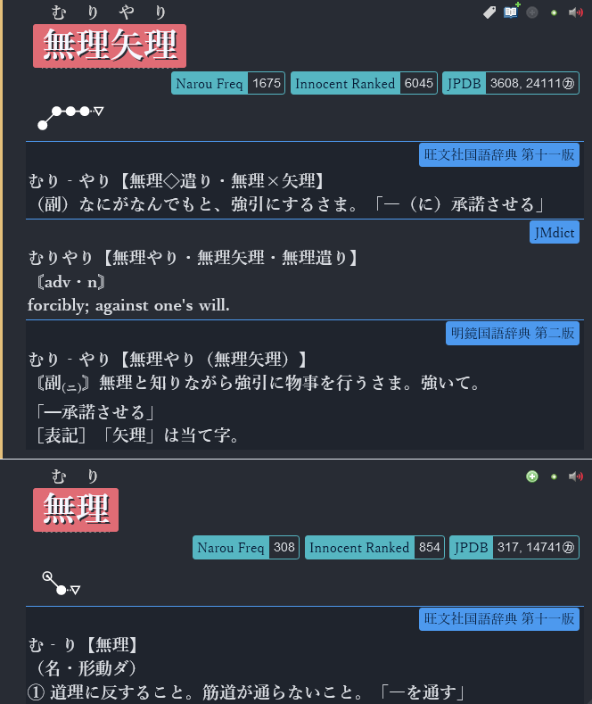

# Yomichan Custom CSS

If you want to have your Yomichan/Yomitan look cool like mine copy the code below and add it in Configure Custom CSS -> Popup CSS in the settings page.



    .gloss-content {
        font-family: Yu Mincho, SimSun !important;
        font-weight: 900;
        font-size: 19px !important;
        line-height: 1.4em;
    }

    .tag-label-content {
        font-family: Yu Mincho, Microsoft YaHei !important;
        font-weight: 400;
        font-size: 15px !important;
    }

    .kanji-gloss-content {
        font-family: Yu Mincho, SimSun !important;
        font-weight: 600;
        font-size: 16px !important;
    }

    .kanji-glpyh {
        font-family: kanji-stroke-orders, sans-serif !important;
        font-size: 8.5em !important;
    }

    .headword {
        font-family: Yu Mincho, SimSun !important;
        font-weight: 900;
        font-size: 19px !important;
    }

    body {
        background: #282c34;
        color: #dcdfe4;

    }

    :root[data-theme="dark"] {
        --tag-border-color: transparent;
        --tag-default-background-color: #88C0D0;
        --tag-name-background-color: #88C0D0;
        --tag-expression-background-color: #88C0D0;
        --tag-popular-background-color: #88C0D0;
        --tag-frequent-background-color: #88C0D0;
        --tag-archaism-background-color: #88C0D0;
        --tag-dictionary-background-color: #4d99ee;
        --tag-frequency-background-color: #56b6c2;
        --tag-part-of-speech-background-color: #88C0D0;
        --tag-search-background-color: #88C0D0;
        --tag-pitch-accent-dictionary-background-color: #5E81AC;
        --accent-color: #e5c07b;
        --pitch-accent-annotation-color: #dcdfe4;
        --input-background-color: #3B4252;
        --reason-text-color: #61aff0;
        --notification-text-color: #ebffff;
        --notification-background-color: #3B4252;
        --progress-bar-track-color: #D8DEE9;
        --light-border-color: #E5E9F0;
        --sidebar-background-color: #2E3440;
        --sidebar-button-background-color: transparent;
        --sidebar-button-background-color-hover: #81A1C1;
        --sidebar-button-background-color-active: #6d88a3;
        --sidebar-button-danger-background-color: transparent;
        --sidebar-button-danger-background-color-hover: #BF616A;
        --sidebar-button-danger-background-color-active: #8a373f;
        --sidebar-button-icon-color: #ebffff;
        --sidebar-button-disabled-icon-color: #808c8c;
        --sidebar-button-danger-icon-color: #ebffff;
    }

    .headword-term {
        background:#e06c75;
        padding: 0 10px;
        margin: auto;
        border-radius: 3px;
    }

    .headword-kanji-link, .headword-term {
        color: #f6f8ff;
        text-shadow: 2px 2px 0 #282c34;
    }

    .tag-label-content {
        color: #061b36;
    }
    .frequency-group-list {
        display: flex;
        justify-content: right;
    }

    .pronunciation-group-tag-list {
        display: none;
    }

    .pronunciation-graph {
        margin: 15px;
        margin-left: 40px;
        transform: scale(1.5);
    }

    .definition-tag-list {
        display: flex;
        justify-content: right;
        border-top: solid 1px;
        border-color: #4d99ee;
    }

    .entry-header {
        margin-left: 2em;
    }

    .definition-item:nth-child(odd) {
        background: #1f242d;
    }

    .definition-list, .pronunciation-list {
        list-style: none;
    }

    .gloss-content {
        padding: 2px;
    }


